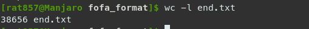
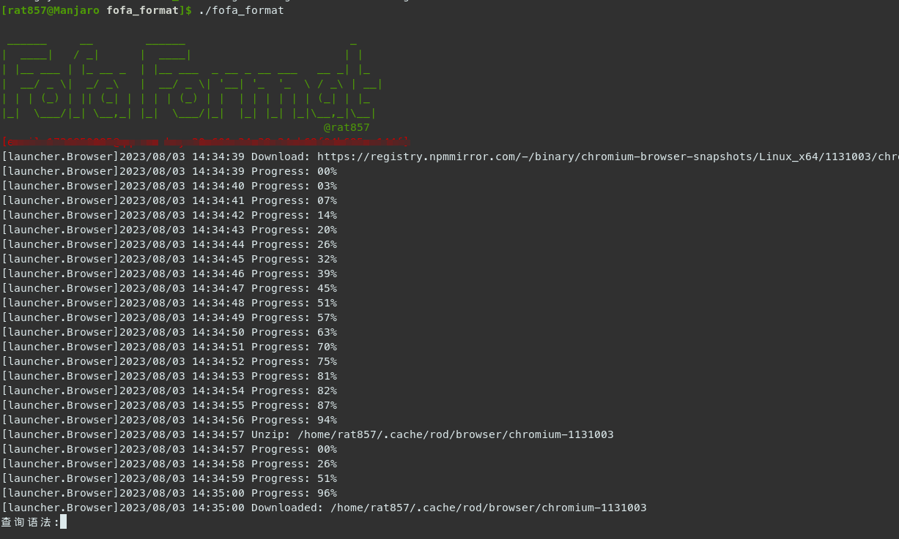

# fofa_format
一键查询fofa并格式化

如果你已经有了未格式化的url.txt只是想格式化成nuclei识别的格式，请访问[format target](https://github.com/rat857/format_target)

2.0版本，用golang重构

## 背景

因为fofa查出来的目标，不方便直接丢扫描器，该工具可以实现一键查询并格式化调出来的目标（需要会员API），并且原始的高级会员也只能查10000个，但有些资产却很多，比如：


所以就想办法尽可能拿到更多的资产

## 新特性

根据不同的country和Server组合成更多的语法来爬取更多的内容，就像这样：




程序会自动去重的


## 用法：

### 用源码自行编译

```shell
git clone https://github.com/rat857/fofa_format.git
go mod tidy
go build
```

```shell
./fofa_format		#Linux
双击							#Windows
```

### 用二进制文件

直接在Packages里下载对应你系统的文件即可

## 注意事项

在获取country和server信息时调用了[go-rod](https://go-rod.github.io/i18n/zh-CN/#/)来执行自动化操作浏览器，如果你第一次使用，他会下载一个东西，就像这样：



下载完后就可以执行查询语法，这个是一个类似浏览器的东西，如果你想看看他自动操作浏览器的步骤可以这样执行

```shell
./fofa_format -rod="show,slow=1s,trace"
```

第一次使用会要求输入email和key,然后自动生成config.yaml,后面就不需要了，若后面需要换号或者换API，直接删掉config.yaml文件即可

抓下来的资产，格式化好的文件会保存在end.txt,(会自动生成)