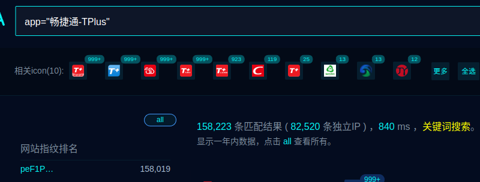
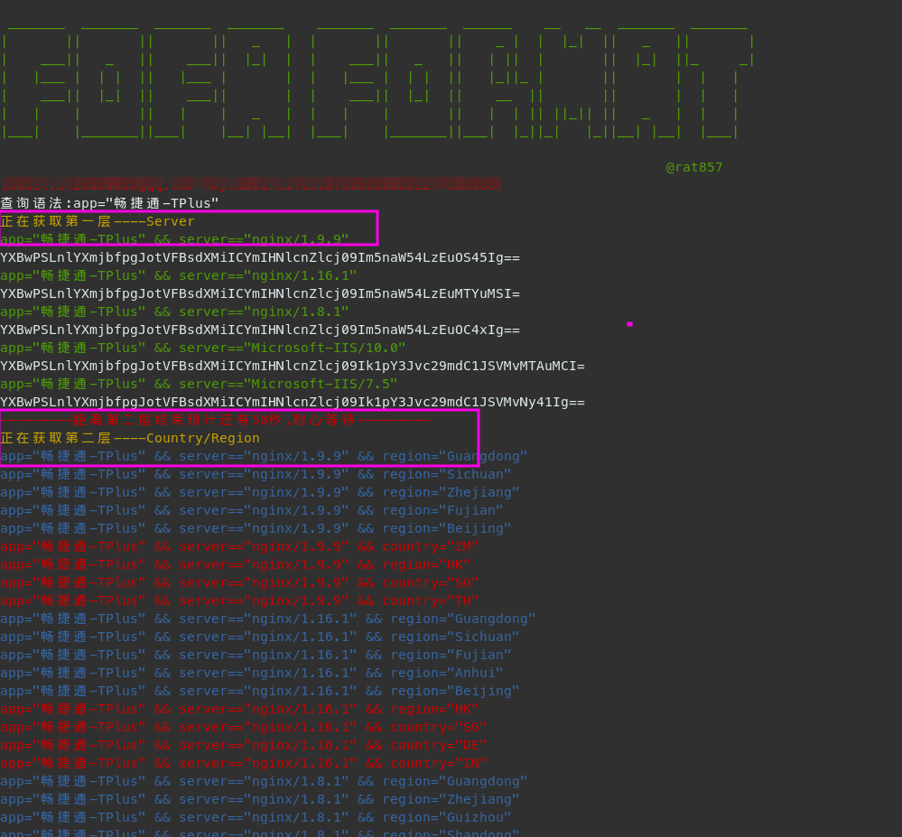
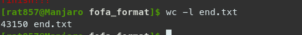
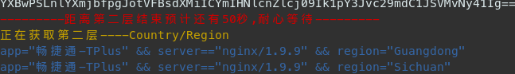
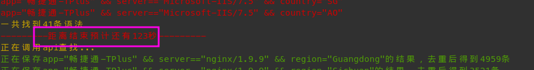
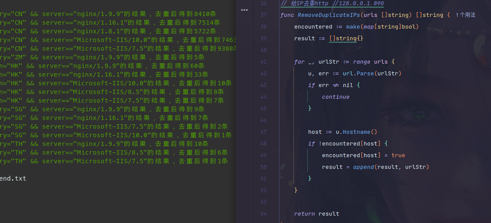

# fofa_format

**一键查询比 10000 更多的 FOFA 资产并格式化**

如果你已经有了未格式化的 url.txt，只是想格式化成 nuclei 识别的格式，请访问 [format target](https://github.com/rat857/format_target)

V3 版本，用 Golang 重构

## 背景

因为 FOFA 查出来的目标不方便直接丢扫描器，该工具可以实现一键查询并格式化调出来的目标（需要会员 API）。原始的高级会员单次也只能查 10000 个，但有些资产却很多，比如：



所以就想办法尽可能拿到更多的资产

## 新特性

根据不同的 Server 和 Country/Region 组合成更多的语法来爬取更多的内容，就像这样：





**贴心**的加上了预计时间：





程序会自动去重：



## 用法

### 用源码自行编译

```shell
git clone https://github.com/rat857/fofa_format.git
cd fofa_format
go mod tidy
go build
```

```shell
./fofa_format    # Linux
双击             # Windows
```

## 首次运行与配置

第一次使用会依次提示输入：

1. **FOFA 站点 URL**（直接回车默认 `https://fofa.info`）
2. **邮箱**
3. **Key**

程序会自动生成 `config.yaml`，后续运行直接读取配置，无需重复输入。

示例：

```yaml
fofa:
  email: your@email.com
  key: your_fofa_key
  url: https://fofa.icu
```

### 支持的 FOFA 站点

默认使用 `https://fofa.info`，也兼容其他中转站，例如：

- `https://fofa.icu`
- `fofa.icu`（会自动补全为 `https://fofa.icu`）

如需更换站点、账号或 API Key，直接修改 `config.yaml`，或删除该文件后重新运行程序。

## 输出文件

查询完成后，格式化结果会保存到当前目录：

| 文件 | 说明 |
|------|------|
| `end.txt` | 全部格式化后的 URL，可直接丢给扫描器 |
| `http.txt` | 仅 HTTP 链接，主要用于 yakit 的 host fuzz |
| `https.txt` | 仅 HTTPS 链接 |

## 注意事项

- 需要 FOFA 会员 API（email + key）
- 若查询语法对应的资产总数小于 10000，会直接查询；大于 10000 时会按 Server / Country / Region 自动分批查询
